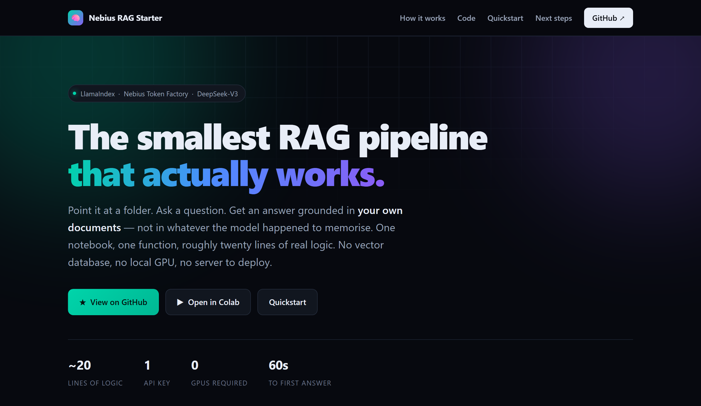
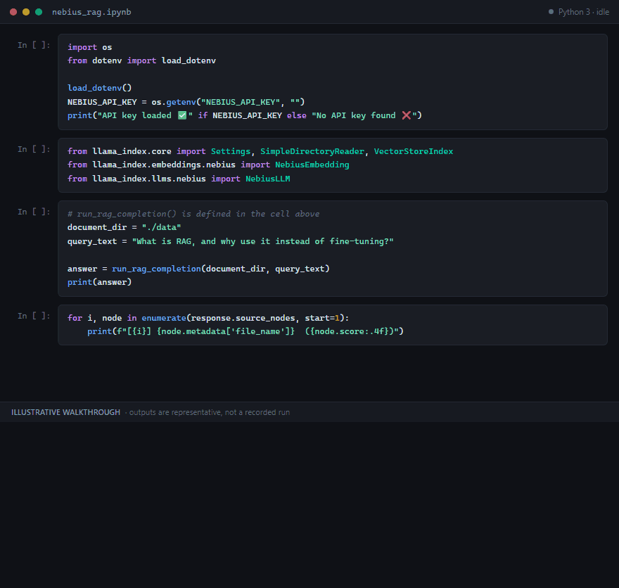
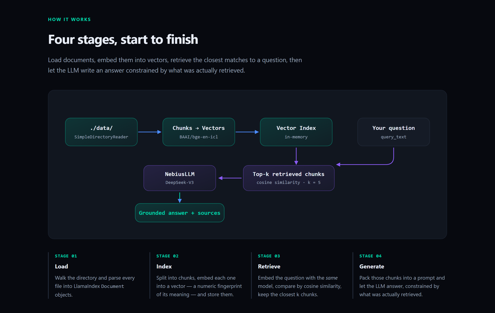

<div align="center">

# 🧠 Nebius RAG Starter

### The smallest RAG pipeline that actually works.

**Point it at a folder. Ask a question. Get an answer grounded in your own documents.**

[](https://tirth1263.github.io/Nebius-RAG-Starter/)
[](https://colab.research.google.com/github/tirth1263/Nebius-RAG-Starter/blob/main/nebius_rag.ipynb)


<br>

<a href="https://tirth1263.github.io/Nebius-RAG-Starter/">
  
</a>

<sub>↑ The project site — <a href="https://tirth1263.github.io/Nebius-RAG-Starter/">tirth1263.github.io/Nebius-RAG-Starter</a></sub>

</div>

---

## 📖 The one-paragraph version

Large language models are confident about things they were never taught. **Retrieval-Augmented Generation** fixes that by looking up the right passage from *your* documents at question time and handing it to the model as context — turning "recall a fact from training" into "read this and answer," a task models are dramatically better at.

This repo is the **minimum viable version** of that idea: a single Jupyter notebook, a single function, roughly twenty lines of real logic. No vector database to run, no local GPU, no server to deploy. Read it in five minutes, understand every line, then build something bigger on top of it.

> **Who this is for:** anyone who has read three RAG blog posts and still wants to see the whole thing in one screen of code.

---

## ⚡ Sixty-second quickstart

```bash
git clone https://github.com/tirth1263/Nebius-RAG-Starter.git
cd Nebius-RAG-Starter
pip install -r requirements.txt

cp .env.example .env          # then paste your Nebius key into .env
jupyter notebook nebius_rag.ipynb
```

Run all cells. The included sample documents in `./data` mean it answers a real question on the very first run — no setup ritual required.

### 🎬 What that looks like

<!-- ══════════════════════════════════════════════════════════════════════
     OPTIONAL: turn the video into an inline player.

     GitHub only renders a video player for files uploaded through its own
     web UI — a committed .mp4 cannot be embedded, which is why the GIF
     below is the default preview. To swap in a real player:

       1. Open a new issue draft on this repo (do NOT submit it):
          https://github.com/tirth1263/Nebius-RAG-Starter/issues/new

       2. Drag assets/demo.mp4 from your clone into the comment box and
          wait for the upload to finish.

       3. GitHub inserts markdown containing a URL shaped like:
          https://github.com/user-attachments/assets/0a1b2c3d-4e5f-...

       4. Copy just that URL. Close the issue draft without submitting.

       5. Paste it on the empty line marked below — bare URL, on its own
          line. No markdown link syntax, no <video> tag; GitHub expands a
          bare user-attachments URL into a player automatically.

     Once the player renders, delete the <div> holding the GIF just below.
     ══════════════════════════════════════════════════════════════════════ -->

<!-- ▼▼ PASTE THE user-attachments URL ON THE EMPTY LINE BELOW ▼▼ -->


<!-- ▲▲ PASTE ABOVE THIS LINE ▲▲ -->

<div align="center">
  
  <br>
  <sub>▶ Also available as a smoother 14-second video — <a href="assets/demo.mp4">assets/demo.mp4</a> (880×836, 218&nbsp;KB)</sub>
</div>

> ⚠️ **Illustrative walkthrough, not a recorded run.** The cells and code are exactly those in `nebius_rag.ipynb`, but the answer text and similarity scores shown are representative examples rather than captured model output. Run the notebook with your own key to see real results.

---

## 🚀 Features

| | |
| --- | --- |
| 📂 **Any folder, any format** | `SimpleDirectoryReader` ingests `.md`, `.txt`, `.pdf`, `.docx`, `.csv` and more from a local directory — no per-format code to write. |
| ⚡ **In-memory vector index** | `VectorStoreIndex` builds the whole index in RAM. Zero infrastructure to stand up while you're learning. |
| ☁️ **Nebius-hosted models** | Embeddings *and* generation run server-side on [Nebius Token Factory](https://dub.sh/nebius). One API key, no local weights, no GPU. |
| 🎯 **One function interface** | `run_rag_completion(document_dir, query_text)` is the entire app. Everything else is commentary. |
| 🔍 **Traceable answers** | Every response carries its `source_nodes` with similarity scores, so you can see exactly which chunk produced which claim. |
| 🔑 **Safe key handling** | Reads from `.env` or the environment, falls back to an interactive prompt. Your key never has to touch the notebook file. |
| 🧩 **Swappable defaults** | Change one string to try a different LLM or embedding model. Nothing else in the pipeline cares. |

---

## 🔬 How it works

<div align="center">
  <a href="https://tirth1263.github.io/Nebius-RAG-Starter/#how">
    
  </a>
</div>

<details>
<summary>Same diagram as plain text</summary>

```
     ┌──────────────┐     ┌──────────────┐     ┌──────────────┐
     │   ./data/    │     │  Chunks +    │     │   Vector     │
     │  documents   │────▶│  Embeddings  │────▶│    Index     │
     └──────────────┘     └──────────────┘     └──────────────┘
     SimpleDirectory-       NebiusEmbedding      VectorStoreIndex
        Reader              BAAI/bge-en-icl        (in-memory)
                                                        │
                                                        │ top-k
     ┌──────────────┐     ┌──────────────┐              ▼
     │   Grounded   │◀────│   NebiusLLM  │◀────┌──────────────┐
     │    Answer    │     │  DeepSeek-V3 │     │  Retrieved   │
     └──────────────┘     └──────────────┘     │    chunks    │
                                               └──────────────┘
                                                        ▲
                                                        │
                                                 "your question"
```

</details>

**1. Load** — `SimpleDirectoryReader` walks your directory and parses every file into LlamaIndex `Document` objects.

**2. Index** — Documents are split into chunks and each chunk is embedded by `BAAI/bge-en-icl` into a vector, a numeric fingerprint of its meaning. All vectors go into an in-memory `VectorStoreIndex`.

**3. Retrieve** — Your question is embedded with the *same* model, then compared against every stored vector by cosine similarity. The `similarity_top_k` closest chunks win.

**4. Generate** — Those chunks are packed into a prompt with your question and sent to `deepseek-ai/DeepSeek-V3`, which writes an answer constrained by what was actually retrieved.

Retrieval quality sets the ceiling on answer quality. If the right passage never gets retrieved, no amount of prompt engineering saves you — which is exactly why the notebook shows you how to inspect the sources.

---

## 🛠️ Tech stack

| Layer | Choice | Why |
| --- | --- | --- |
| **Orchestration** | [LlamaIndex](https://www.llamaindex.ai/) | Handles loading, chunking, indexing and query orchestration in a handful of calls. |
| **Embeddings** | `BAAI/bge-en-icl` via `llama-index-embeddings-nebius` | Strong English retrieval benchmarks, served remotely — nothing to download. |
| **Generation** | `deepseek-ai/DeepSeek-V3` via `llama-index-llms-nebius` | Capable open-weights model with a large context window. |
| **Inference host** | [Nebius Token Factory](https://dub.sh/nebius) | OpenAI-compatible API, one key for both models, per-token billing. |
| **Runtime** | Python 3.9+ / Jupyter | Read the pipeline stage by stage instead of running a black box. |
| **Site** | Static HTML on GitHub Pages | Zero-dependency project page, no build step. |

---

## 📦 Getting started

### Prerequisites

- **Python 3.9+**
- A **[Nebius Token Factory](https://dub.sh/nebius) API key**

### Installation

```bash
git clone https://github.com/tirth1263/Nebius-RAG-Starter.git
cd Nebius-RAG-Starter
pip install -r requirements.txt
```

Or install the packages directly:

```bash
pip install llama-index llama-index-llms-nebius llama-index-embeddings-nebius python-dotenv
```

### Environment variables

Copy the template and fill in your key:

```bash
cp .env.example .env
```

```bash
NEBIUS_API_KEY="your_nebius_api_key"
```

The notebook also accepts an exported shell variable, and prompts interactively via `getpass` if it finds neither — so your key never has to be saved inside the `.ipynb`.

```bash
export NEBIUS_API_KEY="your_nebius_api_key"     # macOS / Linux
$env:NEBIUS_API_KEY = "your_nebius_api_key"     # Windows PowerShell
```

> 🔒 `.env` is gitignored. Never commit a real API key.

---

## 💻 Usage

**1. Open the notebook**

```bash
jupyter notebook nebius_rag.ipynb
```

**2. Set `NEBIUS_API_KEY`** in the environment-variable cell (or export it beforehand).

**3. Point `document_dir` at your own folder** of documents — it defaults to `./data` — set `query_text` to your question, then run all cells.

```python
answer = run_rag_completion(
    document_dir="./data",
    query_text="What is retrieval-augmented generation, and why use it instead of fine-tuning?",
)
print(answer)
```

### The whole pipeline

```python
def run_rag_completion(
    document_dir: str,
    query_text: str,
    embedding_model: str = "BAAI/bge-en-icl",
    generative_model: str = "deepseek-ai/DeepSeek-V3",
    similarity_top_k: int = 5,
) -> str:
    Settings.llm = NebiusLLM(api_key=NEBIUS_API_KEY, model=generative_model)
    Settings.embed_model = NebiusEmbedding(api_key=NEBIUS_API_KEY, model_name=embedding_model)

    documents = SimpleDirectoryReader(document_dir).load_data()
    index = VectorStoreIndex.from_documents(documents)
    response = index.as_query_engine(similarity_top_k=similarity_top_k).query(query_text)

    return str(response)
```

That's it. That's the app.

### Parameters

| Parameter | Default | What it controls |
| --- | --- | --- |
| `document_dir` | — | Folder to index. |
| `query_text` | — | The question to answer. |
| `embedding_model` | `BAAI/bge-en-icl` | Turns text into vectors for retrieval. |
| `generative_model` | `deepseek-ai/DeepSeek-V3` | Writes the final answer from retrieved chunks. |
| `similarity_top_k` | `5` | How many chunks reach the LLM. Higher = broader context and more cost; lower = tighter and cheaper. |

### Reusing the index

`run_rag_completion()` re-indexes on every call — fine for a few documents, wasteful for anything larger. For follow-up questions, build the index once:

```python
index = VectorStoreIndex.from_documents(SimpleDirectoryReader("./data").load_data())
query_engine = index.as_query_engine(similarity_top_k=5)

query_engine.query("What models does Nebius Token Factory serve?")
query_engine.query("What are the three stages of a RAG pipeline?")
```

### Seeing where an answer came from

```python
response = query_engine.query("What are the three stages of a RAG pipeline?")

for node in response.source_nodes:
    print(node.metadata["file_name"], round(node.score, 4))
    print(node.get_content()[:200], "...\n")
```

---

## 📁 Project structure

```
Nebius-RAG-Starter/
├── nebius_rag.ipynb          # RAG walkthrough: load docs, index, query
├── data/                     # Sample documents so it runs out of the box
│   ├── what_is_rag.md
│   └── nebius_token_factory.md
├── docs/
│   └── index.html            # Project site, published via GitHub Pages
├── assets/
│   ├── screenshot.png        # Site preview used in this README
│   ├── pipeline.png          # Pipeline diagram used in this README
│   ├── demo.gif              # Illustrative notebook walkthrough
│   └── demo.mp4              # Same walkthrough, smoother, as video
├── requirements.txt          # Pinned dependency floor
├── .env.example              # Template for your API key
├── .gitignore
├── LICENSE                   # MIT
└── README.md
```

---

## 🧭 Where to go next

This notebook is deliberately the floor, not the ceiling. Once it makes sense, the natural upgrades are:

- **Persist the index** — `index.storage_context.persist("./storage")` so you stop re-embedding unchanged documents on every run. This is the single biggest cost win.
- **Move to a real vector store** — Qdrant, Chroma, or pgvector once your collection outgrows RAM.
- **Add a reranker** — retrieve 20 candidates, rerank, keep the best 5. Vector similarity is a coarse signal and reranking reliably improves precision.
- **Hybrid search** — combine dense vectors with BM25 keyword matching to catch exact terms that embeddings blur over.
- **Tune chunking** — `Settings.chunk_size` and `Settings.chunk_overlap` affect answer quality more than most people expect.
- **Stream the response** — `index.as_query_engine(streaming=True)` for a UI that feels alive.
- **Add OCR ingestion** — for scanned PDFs that `SimpleDirectoryReader` reads as empty pages.

---

## 🐛 Troubleshooting

| Symptom | Likely cause and fix |
| --- | --- |
| `ModuleNotFoundError` after installing | The notebook kernel started before the install. Restart the kernel and re-run. |
| `401` / authentication error | `NEBIUS_API_KEY` is empty, stale, or wrapped in stray quotes. Print `bool(os.getenv("NEBIUS_API_KEY"))` to confirm it loaded. |
| Empty or "I don't know" answers | `document_dir` points somewhere with no readable files, or the index is empty. Check `len(documents)` before indexing. |
| Answers ignore an obviously relevant document | The chunk isn't being retrieved. Raise `similarity_top_k`, then inspect `response.source_nodes` to confirm. |
| Scanned PDFs return nothing | They contain images, not text. You need an OCR loader in the ingestion step. |
| Slow first query | Every chunk is embedded on the first run. Persist the index to avoid paying that again. |

---

## 🤝 Contributing

Issues and pull requests are welcome. If you extend this into something bigger — reranking, hybrid search, a persistent store — open a PR or an issue with a link; the goal is for this to stay the clearest starting point available.

---

## 📄 License

Released under the [MIT License](LICENSE). Use it, fork it, ship it.

---

<div align="center">

**Built with [LlamaIndex](https://www.llamaindex.ai/) and [Nebius Token Factory](https://dub.sh/nebius)**

If this saved you an afternoon, consider leaving a ⭐

</div>
